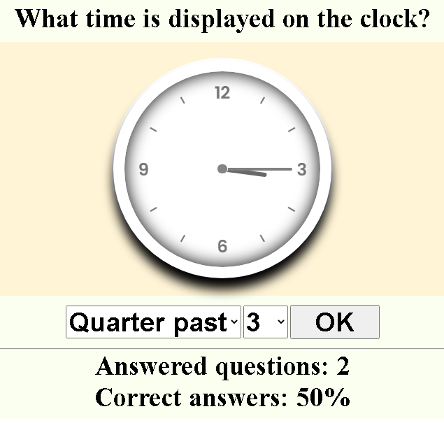
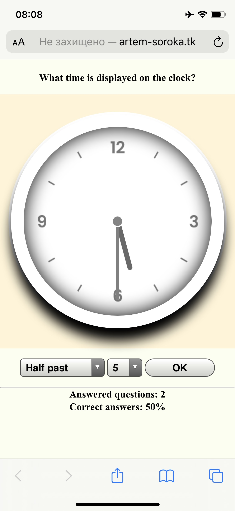

# Reading time from the clock

I wrote this simple test to help my daughter learn how to read time from the clock. Random minutes are limited to 4 positions only (o'clock, quarter past, half past and quarter to).    
It is based around `transform: rotateZ()` CSS parameter and using `Z-index` to create layers of clock parts.
       
This is example:     
   

     
I created rules to make look better on small screens as well.
      
 
                      

### Test it yourself
Live version can be found [here](http://artem-soroka.tk/pages/time/ "Time test").   
     
Thank you.